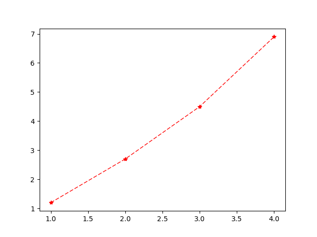

# Matplotlib 画图

## 介绍
学习如何使用Python Matlibplot进行绘图操作

## 配置
Python 2.7 或 3.6  
Numpy 1.13.3  
Matplotlib 2.0.0

## 简介

Matplotlab是python最著名的绘图库，它提供了一整套和matlab相似的命令API,十分适合交互式地制图，其中，matplotlib地pyplot模块一般是最常用地。

## 画图

### 1. 折线图  
绘制一个简单的折线图，折线图的横坐标和纵坐标是离散的，而且是一一对应，例如：
      	
		x = [1,2,3,4]
		y = [1.2,2.7,4.5,6.9]

可以由以下代码实现：

```python
import matplotlib.pyplot as plt
x = [1,2,3,4]
y = [1.2,2.7,4.5,6.9]
plt.plot(x, y)
plt.show()  
```  
<table width="100%">
<tr>
<td></td>
</tr>
</table>

注意：```show()```函数在通常运行情况下，会阻塞程序的运行，直到用户关闭绘图窗口。在```show()```函数弹出的图像窗口前，```show()```函数后面的代码不会运行，直到用户关闭图像窗口才会继续。此外，还可以调用```pltsavefig()```将当前的Figure对象保存成图像文件，图像格式由图像文件的扩展名决定。比如，可以将生成的图像另存为“test.png”，并且用dpi参数指定图像的分辨率为120，最后输出图像的宽度为 $8\times120=960$个像素。

```python
plt.savefig("test.png", dpi=120)
```

### 2. 绘制不同风格
可以对折线本身的风格进行优化。最好是每个记录的点突出，同时折线的颜色，粗细以及样式可控。优化后，我们得到了下图：  

<table width="100%">
<tr>
<td></td>
</tr>
</table>

具体代码如下：

```python
import matplotlib.pyplot as plt
x = [1, 2, 3, 4]
y = [1.2, 2.5, 4.5, 7.3]
plt.plot(x, y, color="r", linestyle="--", marker="*", linewidth=1.0)
plt.show()
```

解释一下，plot函数中，x,y后面的参数分别用来控制线条颜色，线条风格，线条标记以及线条粗细。这个编码风格和matlab是极为相似的。我将常用的参照表摘抄如下，供参考：

* 线条风格

线条风格 | 实线 | 虚线 | 破折线 | 点划线 | 无线条 |
------- |:---:|:---:|:---:|:---:|:---:|
代码表示 |  -  |  :  |  _  |  -. | None or ,|

* 线条颜色

线条风格 | 红| 洋红 | 黄 | 绿 | 青 | 蓝 | 黑 | 白 | 
------- |:---:|:---:|:---:|:---:|:---:|:---:|:---:|:---:|
代码表示 |  r  |  m  |  y  |  g | c | b | k | w |

* 线条标记

| 标记 | 描述 | 标记 | 描述 | 标记 | 描述 |
|:---:|:---:|:---:|:---:|:---:|:---:|
| o| 圆圈| . | 点 | *| 星号|
| +| 加号| v | 朝下三角 | ^| 朝上三角|
| <| 朝左三角| > | 朝右三角 | D| 大菱形|
| d| 小菱形| s | 正方形 | P| 五边形|
| H| 大六边形| h | 小六边形 | p| 八边形|
| x| ✘号| None or , | 无标记 | | |

### 3. 坐标轴的控制

优化坐标轴。这当中主要涉及的是坐标轴的范围，取值以及名称。我们现在重新绘制一个连续的曲线。以$y=sin(x)$为例，手下画$[-\pi, \pi]$之间的函数图，代码及图像如下：

```python
import matplotlib.pyplot as plt
import numpy as np
x = np.arange(-5, 5, 0.02)
y = np.sin(x)
plt.axis([-np.pi, np.pi, -2, 2])
plt.plot(x, y, color="r", linestyle="-", linewidth=1)
plt.show()
```

<table width="100%">
<tr>
<td></td>
</tr>
</table>

可以看出对x的取值范围在$[-5,5]$, 但是在绘图的时候，只是展示了$[-\pi,\pi]$之间的函数图。另外，后面的$[-2,2]$控制的是y轴方向的取值。

### 4. 坐标范围

总结一下，下面形式的函数可以控制图像的绘图范围：

```python
plt.axis([x_min, x_max, y_min, y_max])
```

如果只是单独想要控制x轴或者有轴的取值，则可以用```plt.xlim(x_min, x_max)```和```plt.ylim(y_min, y_max)```，用法与```plt.axis()```类似。

### 5. 坐标标题

函数```plt.xlabel()```和```plt.ylabel()```用来实现x轴和y轴添加标题。

### 6. 坐标间隔设定

函数```plt.xticks()```和```plt.yticks()```用来实现对x轴和y轴坐标间隔（也就是轴记号）的设定。用法上，函数的输入是两个列表，第一个表示取值，第二个表示标记。当然如果你的标记就是取值本身，则第二个列表可以忽略。下面举一个例子：

```python
import matplotlib.pyplot as plt
import numpy as np

x = np.arange(-2 * math.pi, 2 * math.pi, 0.02)
y = np.sin(x)

plt.axis([-10, 10, -2, 2])

plt.xticks([i * np.pi/2 for i in range(-4, 5)], [str(i * 0.5) + "$\pi$" for i in range(-4, 5)])
plt.yticks([i * 0.5 for i in range(-4, 5)])

plt.xlabel("x")
plt.ylabel("y")

plt.plot(x, y, color="r", linestyle="-", linewidth=1)
plt.show()

```

画出的图像如下所示：

<table width="100%">
<tr>
<td></td>
</tr>
</table>

可以看到```plt.xticks()```中，后面的列表储存了应该出现的所有标记，这是我们自定义的标记，而且这里支持latex公式表达。

### 7. 多图叠加
#### 多曲线

大多时候，需要在同一张图中出现多条曲线，以便我们对数据有个直观的比较。那么做法非常简单，直接写多个作图函数```plot()```即可，比如，按照如下代码，将两条曲线画在同一张图中：

<table width="100%">
<tr>
<td></td>
</tr>
</table>

```python
import matplotlib.pyplot as plt
import numpy as np

x = np.arange(-1, 1, 0.1)
y1 = np.exp(x)
y2 = np.exp(2 * x)

plt.plot(x, y1, color="r", linestyle="-", marker="^", linewidth=1)

plt.plot(x, y2, color="b", linestyle="-", marker="s", linewidth=1)

plt.xlabel("x")
plt.ylabel("y")

plt.show()
```

#### 多图与子图

```figure()```函数可以帮助我们同时处理生成多个图，而```subplot()```函数则用来实现。  
在一个大图中，出现了多个小的子图。需要注意的是，```figure()```中的参数为图片序号，一般是按序增加的，这里面还涉及一个当前图的概念，具体可以通过下面的例子来理解：

```subplot()```中的参数一般有3个，分别为行数，列数以及子图序号。比如，```subplot(1,2,1)```表示这是一个1行，2列布局的图（两个子图，在同一行，分居左右），其中，当前处理的子图是第一个图（也就是作图）。例如：

```python
import matplotlib.pyplot as plt
import numpy as np

x = np.arange(-1, 1, 0.1)

y1 = np.exp(x)
y2 = np.exp(2 * x)
y3 = np.exp(1.5 * x)

plt.figure(1)
plt.subplot(1, 2, 1)
plt.plot(x, y1, color="r", linestyle="-", marker="^", linewidth=1)

plt.xlabel("x")
plt.ylabel("y1")

plt.figure(2)
plt.plot(x, y2, color="k", linestyle="-", marker="s", linewidth=1)

plt.xlabel("x")
plt.ylabel("y2")

plt.figure(1)
plt.subplot(1, 2, 2)
plt.plot(x, y3, color="b", linestyle="-", marker="v", linewidth=1)

plt.xlabel("x")
plt.ylabel("y3")

plt.show()
```

这样，就可以用一个脚本画两张图fig.1 和 fig.2。fig.1为：

<table width="100%">
<tr>
<td></td>
</tr>
</table>

fig.2为:

<table width="100%">
<tr>
<td></td>
</tr>
</table>

如果希望某个子图占据正行或者整列，可以调用```subplot()```:

```python
plt.subplot(2,2,1) # 第一行的左图
plt.subplot(2,2,2) # 第一行的右图
plt.subplot(2,1,2) # 第二行整
plt.show()
```
画底下的大图时，实际上相当于把前两个小的子图看作一个整图。

### 8. 标题和图例

#### 图像标题

函数```plt.title()```用来对图像命名。

#### 图例

函数```plt.legend()```用来为图像添加图例。标题和图例我用以下的例子做一个简单介绍：

<table width="100%">
<tr>
<td></td>
</tr>
</table>

```python
import matplotlib.pyplot as plt
import numpy as np

x = np.arange(-1, 1, 0.1)

y1 = np.exp(x)
y2 = np.exp(2 * x)

plt.plot(x, y1, color="r", linestyle="-", marker="^", linewidth=1, label="y1")
plt.plot(x, y2, color="b", linestyle="-", marker="s", linewidth=1, label="y2")

plt.legend(loc='upper left', bbox_to_anchor=(0.2, 0.95))

plt.title("Figure 1")

plt.show()
```

```legend()```里面的参数loc表示图例的位置，参数```bbox_to_anchor```是一个二元组，用来进一步细化图例的位置，其中第一个数值用于控制legend的左右移动，值越大越向右边移动，第二个数值用于控制```legend```的上下移动，值越大，越向上移动。此外，我们在画两条曲线时，分别为它们添加了标签label，标签的内容也就是最后图例中对应的内容。

### 9. 网格，背景色以及文字注释
#### 添加网格

和matlab一样，用函数```grid()```添加网格，函数中我们可以定义网格的样式，比如线条颜色，类型，粗细等等。需要注意的是，如果你只想在对x轴，或者y轴添加网格，只需要设定参数```axis="x"```或```axis="y"```即可。```axis```参数一般默认为"both"表示，两个维度上都建立网格。

<table width="100%">
<tr>
<td></td>
</tr>
</table>

```python
import matplotlib.pyplot as plt
import numpy as np

x = np.arange(-1, 1, 0.1)

y = [2 * i for i in x]

plt.plot(x, y, color="r", linestyle="-", marker="^", linewidth=1)

plt.grid(color="k", linestyle=":")
plt.show()
```

#### 背景色

通过向```plt.subplot()```函数传递参数```facecolor```设置图像的背景色。需要注意的是背景色的设置代码应该在绘制曲线之前，否则相当于给整张图上色，覆盖了要展示的曲线。比如下图，我设置背景色为绿色。其实这个功能在我看来实在是没什么大用，大多情况下，我们要用到的背景色都是白色，也就是默认的背景色。

#### 文字注释

```plt.text()```, ```plt.annotate()```是两种向图像添加文本注释的方法。plt.text()可以在图像任意位置添加文字，```plt.annotate()```则可以帮助我们形象地为曲线中的某一个点添加注释。

<table width="100%">
<tr>
<td></td>
</tr>
</table>

```python
import matplotlib.pyplot as plt
import numpy as np

x = np.arange(-1, 1, 0.1)

y1 = np.exp(x)
y2 = np.exp(2 * x)

plt.plot(x, y1, color="r", linestyle="-", marker="^", linewidth=1)
plt.plot(x, y2, color="b", linestyle="-", marker="s", linewidth=1)

plt.text(-0.5, 3, "exp functions", fontsize=10)

plt.show()
```

```plt.text()```中前两个参数表示添加文字的坐标位置，最后一个参数是要添加的文本。  
```plt.annotate()```与```plt.text()```类似，代码表示如下:

```python
plt.annotate('A', xy=(0, 1), xytext=(-0.5, 2.5), arrowprops=dict(facecolor='k', headwidth=10, width=2))
```

分别解释一下，第一个参数’A’是注释文本，```xy```表示要注释的点的坐标，```xytext```表示注释文本的起始坐标，```arrowprops```表示箭头，我们可以通过一个字典形的变量，设置其样式，包括颜色，宽度等等（```headwidth```表示箭头宽度，```width```表示箭身的宽度）。画出来的图如下所示：

<table width="100%">
<tr>
<td></td>
</tr>
</table>

关于matplotlib绘图基础，先说这么多哈。

参考：
[Python--matplotlib绘图](https://blog.csdn.net/guoziqing506/article/details/78975150)


